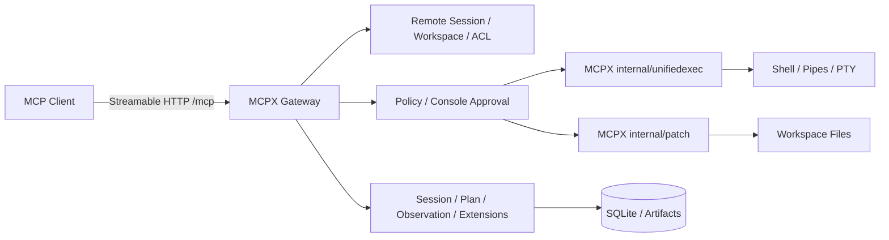

# MCPX

MCPX 是运行在本地开发环境中的 MCP Runtime（网关）。它通过
Streamable HTTP 把本地 Workspace、源码、变更、命令、任务、环境和扩展能力
安全地提供给 ChatGPT、Claude、Cursor、Grok 等 MCP 客户端。

编程核心在 MCPX 内部运行：`internal/unifiedexec` 和 `internal/patch` 参照固定版本的
Codex 源码移植进程、PTY 与补丁逻辑。MCPX 将这些能力绑定到已认证的 Remote Session
和 Workspace，并执行网关的权限、审批与观测策略；无需 Codex 可执行文件。
读取源码和搜索使用 `exec_command` 运行 `rg`、`cat`、`sed`；修改文件使用 `apply_patch`。

## 能力概览

| 能力 | 说明 |
| --- | --- |
| 本地进程 | `exec_command` 通过 MCPX 原生 backend 启动 shell 命令，`write_stdin` 等待输出或写入 stdin；支持 PTY |
| 本地补丁 | `apply_patch` 通过 MCPX 原生 backend 解析和应用补丁，支持 Add、Update、Delete 和 Move |
| Remote Session | 持久化 Workspace 绑定、角色、事件和跨客户端恢复 |
| 管理面 | 会话、计划、观测、产物、环境快照、扩展和批量管理操作 |
| 扩展 | 按需访问本地 Skill、上游 MCP 与官方浏览器扩展 |
| 安全 | OAuth/Bearer、Remote Session ACL、命令/文件策略和 console 审批 |

## 架构



进程管理、输出缓冲、stdin 与补丁解析/匹配在 MCPX 自身的 Go 包中实现，
不启动 Codex CLI 或 exec-server，不调用模型/API。外部 `/mcp` 使用标准 MCP 协议。
核心不得设计成外部 Codex/exec-server/apply_patch 可执行文件的 wrapper，
也不得以本地实现失败后转调这些程序的 fallback 维持表面通过。

源码参考固定为 `68e0c9f5d8fd9449e97a81e92e8fcb86795713b2`。这是选定逻辑的移植，
并非整个 Codex 的逐行等价实现，也不包含完整的 Codex sandbox、审批编排或模型 agent。
移植来源与修改见 [SOURCE.md](third_party/codex/SOURCE.md)；本轮验收状态见
[原生工具链验证记录](docs/results/2026-09-26-native-toolchain-port.md)，未验证项目保持待主线验证。

## 公开工具

`tools/list` 是名称、描述、参数 Schema 和 Annotation 的权威来源。共 20 个公开工具：
3 个 MCPX 原生编程工具，17 个 MCPX 网关管理工具。管理工具不构成另一套编程核心。

| 类别 | 工具 | 主要用途 |
| --- | --- | --- |
| 编程 | `exec_command` | 执行 shell 命令，包括源码读取、搜索、测试和构建 |
| 编程 | `write_stdin` | 使用整数进程句柄等待输出或写入 stdin |
| 编程 | `apply_patch` | 在本地应用 Codex 格式的原始补丁 |
| 管理 | `workspace` | 列出已注册 Workspace |
| 管理 | `session` | 创建、列出、恢复或关闭 Remote Session |
| 管理 | `move_out` | prepare 冻结安全移出清单，用户确认后 submit |
| 管理 | `observe` | 查看网关会话、历史、持久任务和日志 |
| 管理 | `progress` | 发布里程碑、等待、阻塞、失败或完成结果 |
| 管理 | `plan` | 管理持久化计划 |
| 管理 | `artifact` | 登记、列出和分片读取产物 |
| 管理 | `skill_tool` | 按需 list、describe、call 本地 Skill |
| 管理 | `mcp_tool` | 按需 list、describe、call 上游 MCP |
| 管理 | `operation_batch` | 按 DAG 编排网关管理面操作 |
| 管理 | `operation_manage` | 查询、等待、读取、取消或恢复管理面 Operation |
| 管理 | `runtime_read` | 读取运行时能力、项目摘要和适用指令 |
| 管理 | `environment_read` | 读取主机/工具链环境或比较快照 |
| 管理 | `environment` | 保存环境快照 |
| 管理 | `browser` | 通过官方浏览器扩展操作标签页和页面 |
| 管理 | `screenshot_capture` | 截取显示器或区域 |
| 管理 | `secret_provide` | 向会话提供驻留内存的 Secret |

`read`、`edit`、`execute` 已从公开目录移除，无公开别名。编程工具直接调用，不先 describe，
不通过 `operation_batch` 包装；网关扩展的 describe 仅用于取得尚未知晓的扩展规则或参数。

## 会话与权限边界

| 标识 | 生命周期 | 用途 |
| --- | --- | --- |
| `Mcp-Session-Id` | MCP transport 连接 | HTTP 协议状态与当前绑定 |
| `remote_session_id` | 持久化 Remote Session | 已认证的 Workspace、角色和管理状态 |
| `session_id`（integer） | MCPX 本地执行进程 | `write_stdin` 的进程句柄，不能与前两者互换 |

当前 MCP transport 已绑定 Remote Session 时可省略 `remote_session_id`；显式传入只用于路由，
仍需通过权限检查。`exec_command.workdir` 默认 session root，解析后的物理目录必须在
Workspace 内。`apply_patch` 固定在 session root 应用补丁，没有 workdir 参数。
进程句柄不承诺跨 Runtime 重启恢复，也不转换成 Operation 或持久 Task ID。

MCPX 强制应用服务端配置的权限。需要 Confirm 时，由现有 console 对原始 cmd/input 审批，
操作用途由 Runtime 推导；编程工具不要求模型传 `purpose` 或 `user_confirmed`。
不暴露 `sandbox_permissions`、`justification`、`prefix_rule` 或模型可选的提权模式。
这不是 Codex Agent 的 sandbox/approval 协议；cwd 的 Workspace 校验也不等于 OS 级沙箱。

MCPX 提供 Streamable HTTP 的 `/mcp` 端点。

## 部署教程

- [FRP + Caddy 原生部署：公网暴露 MCPX（非 Docker）](docs/frp-caddy-native.md)
- [FRP + Caddy + Docker Compose：公网暴露 MCPX（MCPX 保持原生运行）](docs/frp-caddy-docker-compose.md)

两篇教程都保持 MCPX 原生运行，保留对本地 Workspace、工具链、桌面和扩展能力的访问。原生版直接运行 Caddy/frps/frpc；Docker Compose 版只容器化 Caddy/frps/frpc。两篇文档均包含 OpenAI / ChatGPT Remote MCP 配置示例与截图。

## 快速开始

### 环境要求

- Go 1.26.1 或更高版本，具体版本以 `go.mod` 为准。
- 本机 shell 与任务所需命令；三个编程核心不依赖 Codex CLI、模型或 API key。
- 源码搜索示例需要 `rg`；读取使用系统 `cat` / `sed`。
- 一个需要被 MCPX 管理的本地项目目录。
- 远程访问时需要 HTTPS 反向代理或其他受信任的网络入口。

### 从源码构建

```bash
git clone https://github.com/opentokenz/mcpx.git
cd mcpx
go build -o bin/mcpx ./cmd/mcpx-server
```

本地静态构建可以关闭 CGO：

```bash
CGO_ENABLED=0 go build -o bin/mcpx ./cmd/mcpx-server
```

普通 VCS 构建会从 Go build info 回填当前 Git revision（工作树有未提交变更时带 `-dirty`）；
正式发布仍以 GoReleaser 的 linker flags 为权威来源，同时注入版本、commit 和真实 build time。
CI 会构建带 provenance 的二进制并通过 `mcpx -version` 校验 commit/date 未丢失。

### 启动服务

前台运行：

```bash
./bin/mcpx
```

后台运行：

```bash
./bin/mcpx -d
```

后台模式会记录 daemon 状态到 `~/.mcpx/mcpx-daemon.json`，日志写入
`~/.mcpx/logs/mcpx-daemon.log`。再次启动前台服务或新的后台实例时，MCPX 会先停止
状态文件中仍存活的旧后台进程。

注册或更新一个 Workspace：

```bash
./bin/mcpx workspace register /path/to/your/project
```

服务启动时会校验每个已注册 Workspace 的根路径。若父目录尚不可用（例如外置
磁盘还未挂载），启动会等待该路径出现；等待超时后仍会保留注册并记录 warning，
不会把临时不可用当成已删除。父目录存在但目标目录已消失或不是目录的条目会被
从 `config.yaml` 中移除，因此已删除的 disposable worktree 不需要手工清理。

然后启动服务：

```bash
./bin/mcpx
```

默认监听地址和 MCP 端点：

```text
http://127.0.0.1:9090/mcp
```

首次启动会在 `~/.mcpx/`（可用 `MCPX_HOME` 覆盖）初始化运行时目录：

| 路径 | 用途 |
| --- | --- |
| `config.yaml` | 全局监听、鉴权、安全策略和 Workspace 配置 |
| `.mcp.json` | 全局上游 MCP Server 配置 |
| `logs/` | JSONL 审计和运行日志 |
| `skills/` | 可选的本地 Skill 根目录 |
| `workspaces.example.yaml` | Workspace 配置示例 |
| `state/mcpx.db` | Remote Session、Edit、Task、Plan、操作、快照和产物索引 |
| `tasks/` | 持久终端 Task 的日志文件 |

查看版本和命令帮助：

```bash
./bin/mcpx -version
./bin/mcpx -h
```

主要命令包括：

```text
mcpx [flags]                     启动 Streamable HTTP 服务
mcpx stop                        停止后台服务
mcpx desktop                     启动托盘与图形界面（仅 Windows）
mcpx observe [flags] <name>      终端只读观测 Workspace 事件
mcpx workspace register <path>   注册或更新 Workspace（不启动服务）
mcpx oauth-register [url]        动态注册 OAuth 客户端
mcpx update [flags]              从 GitHub Release 检查并安装新版本
```

服务进程常用 flags 包括 `-addr`、`-log-level`、`-log-format`、`-d` 和 `-version`。
自更新支持：

```bash
./bin/mcpx update --check
./bin/mcpx update
./bin/mcpx update --version 0.9.6
```

`update` 会选择当前平台对应的 GitHub Release 产物，校验 `checksums.txt` 中的 SHA-256，
再验证下载后的二进制版本并替换当前可执行文件；访问 GitHub API 需要认证时可使用
`GITHUB_TOKEN`。

## 配置

### 全局配置

全局配置路径为 `~/.mcpx/config.yaml`，可用 `MCPX_HOME` 改变根目录。
下面是一个偏保守的常用配置示例；相比首次生成的默认配置，它把未知命令的默认决策收紧为 `confirm`：

```yaml
server:
  host: 127.0.0.1
  port: 9090

auth:
  # open | bearer | oauth | dual
  # 留空时：配置 token 则等同 bearer，否则等同 open。
  mode: open
  token: ""
  oauth:
    password: ""
    server_url: ""
    token_ttl: 86400

workspaces:
  - name: my-app
    path: /Users/you/code/my-app
    description: "业务项目"

security:
  commands:
    # allow | confirm | deny
    default: confirm
    allow:
      - ^pwd$
      - ^ls\b
      - ^git status
      - ^git diff
    confirm:
      - ^git push
      - ^docker
      - ^npm install
    deny:
      - ^rm -rf /
  files:
    max_read_bytes: 1048576
    max_patch_files: 20
    max_patch_lines: 2000
    deny:
      - ^\.git/

limits:
  max_result_bytes: 262144
  max_mcp_result_bytes: 4194304
```

首次生成配置默认监听 `127.0.0.1:9090`，MCP transport 空闲 Session TTL 为 `24h`。
补丁接受 Workspace 路径和文件拒绝规则检查；命令输出由编程工具的
`max_output_tokens` 控制。网关管理结果和上游 MCP 结果分别受 `limits.max_result_bytes`
与 `limits.max_mcp_result_bytes` 约束，后者默认 4 MiB。具体可用性与限制以运行时配置为准。

需要特别注意：当前首次生成的 `config.yaml` 使用 `security.commands.default: allow`，同时内置
`git push` / `docker` / `npm install` 的 `confirm` 规则和 `rm -rf /` / `mkfs` / `shutdown` 的
`deny` 规则；`auto_allow_readonly` 未显式配置时也会自动允许受支持的只读命令。策略匹配顺序是
`deny` → `confirm` → `allow` → 只读自动放行 → `default`。共享环境或公网部署建议像上面的示例一样
把默认决策收紧为 `confirm` 或 `deny`。公网部署同时不要使用 `auth.mode: open`，应使用 `oauth`、
`bearer` 或 `dual`，并配置最小权限规则。

命令权限检查针对原始 `cmd`，允许后由 MCPX 本地进程 backend 启动 shell；shell 语法、引号和 stdin
由所选 shell 解释。不要把程序会执行的副作用描述为只读，也不要通过 shell 或补丁绕过拒绝规则。
确认发生在 console，不通过给调用添加 `user_confirmed` 改变权限。

### 项目配置

项目根目录可以放置 `.mcpx.yaml`，用于覆盖项目描述、项目级安全规则、能力
开关和结果限制。进程级身份凭证不应写在项目配置中。

```yaml
description: "项目说明"

security:
  commands:
    default: confirm
```

### 上游 MCP

全局配置使用 `~/.mcpx/.mcp.json`。项目级按以下顺序合并，后出现的同名 Server 覆盖前面的：

1. `{workspace}/.mcp.json`
2. `{workspace}/.agents/mcp.json`
3. `{workspace}/.mcpx/.mcp.json`

缺失文件视为空配置。项目级同名 Server 覆盖全局配置；`.mcpx/.mcp.json` 是 MCPX 原生覆盖层，优先级最高。

```json
{
  "mcpServers": {
    "github": {
      "type": "stdio",
      "command": "npx",
      "args": ["-y", "@modelcontextprotocol/server-github"],
      "env": {
        "GITHUB_TOKEN": "${GITHUB_TOKEN}"
      }
    }
  }
}
```

### Skill 发现

默认扫描 `~/.mcpx/skills`、`~/.agents/skills`、`~/.codex/skills`、
`~/.grok/skills` 和项目 `.skills`。可以在全局配置中使用
`discovery.skills.dirs` 和 `extra_dirs` 增加或替换目录。

### 状态保留

`state.retention` 负责定期回收过期的观测、Task 日志、快照和临时记录。
观测事件和已完成 Task 不再因为 Remote Session 处于 `active`、`idle` 或 `blocked`
而永久跳过 TTL 和行数限制；运行中的 Task、被持久化执行证据引用的 Task、未完成
Plan、未过期确认、有效幂等记录和仍被引用的快照会受到保护。`command.output` 按执行 Task
合并限制累计观测体量，超限后通过 Task 日志 Resource URI 恢复。保留策略只在全局
`config.yaml` 中生效。

## 接入 MCP 客户端

### 本地 Bearer 客户端

```json
{
  "mcpServers": {
    "mcpx": {
      "url": "http://127.0.0.1:9090/mcp",
      "headers": {
        "Authorization": "Bearer YOUR_TOKEN"
      }
    }
  }
}
```

将 `auth.mode` 设置为 `bearer`，并在 `auth.token` 中配置 Token。仅本机临时
调试可以使用 `open`。

### 网页端 Remote MCP

网页端通常使用 OAuth。先通过反向代理暴露 HTTPS，再配置：

```yaml
server:
  disable_localhost_protection: true
  trust_proxy_headers: true

auth:
  mode: oauth
  oauth:
    password: "换成强口令"
    server_url: "https://mcp.example.com"
```

然后将 `https://mcp.example.com/mcp` 添加到客户端（ChatGPT / Codex Remote MCP）。

OAuth 对齐 [OpenAI MCP 鉴权约定](https://developers.openai.com/plugins/build/auth) 与
MCP Authorization（OAuth 2.1 + PKCE）：

- 资源元数据：`/.well-known/oauth-protected-resource`（及 `/mcp` 路径形态）
- 授权服务器元数据：`/.well-known/oauth-authorization-server`（含
  `client_id_metadata_document_supported: true`，优先 CIMD）
- DCR：`POST /mcp/oauth/register`（CIMD 不可用时仍可用）
- 授权 / 换票：`/mcp/oauth/authorize`、`/mcp/oauth/token`（`resource` 参数 + S256）

ChatGPT 使用 **CIMD**（`client_id` 为 `https://chatgpt.com/oauth/...` 文档 URL）时，
服务端会拉取并校验元数据，并接受
`https://chatgpt.com/connector/oauth/{callback_id}` 与旧回调
`https://chatgpt.com/connector_platform_oauth_redirect`。
仍可用手动 DCR 预注册：

```bash
./bin/mcpx oauth-register 'https://chatgpt.com/connector/oauth/...'
# 或交互输入回调地址：
./bin/mcpx oauth-register
```

OAuth 发现与授权端点包括：

```text
GET  /.well-known/oauth-protected-resource
GET  /.well-known/oauth-authorization-server
POST /mcp/oauth/register
GET|POST /mcp/oauth/authorize
POST /mcp/oauth/token
```

产品不内置公网隧道服务。反向代理负责 HTTPS、域名和网络暴露，MCPX 负责
MCP 协议、鉴权和 Workspace 访问控制。

### 握手探测

不要用裸 `GET /mcp` 判断服务是否可用，使用 MCP `initialize` 请求：

```bash
curl -sS -m 5 \
  -H 'Content-Type: application/json' \
  -H 'Accept: application/json, text/event-stream' \
  -d '{"jsonrpc":"2.0","id":1,"method":"initialize","params":{"protocolVersion":"2025-11-25","capabilities":{},"clientInfo":{"name":"curl","version":"0.1"}}}' \
  http://127.0.0.1:9090/mcp
```

响应中出现 `mcpx` Server 信息表示协议握手成功。

## 推荐交互流程

### 1. 绑定 Workspace

Workspace 名称未知时调用零参数 `workspace`，再用
`session(action="open", workspace="项目名")` 建立会话。恢复时使用服务端返回的完整
`remote_session_id`；ID 丢失时先用 `session(action="list")` 查找。

会话返回项目摘要、适用指令和扩展清单。工具参数已知时可直接调用，源码工作不要求预先读取
能力清单、describe 或 revision token。`runtime_read`、`environment_read` 是按需的管理信息入口。

### 2. 读取和搜索源码

以下是 `exec_command` 参数：

```json
{"cmd":"rg -n 'handleRequest' internal/server","max_output_tokens":4000}
```

读取已知文件可用 `cat AGENTS.md` 或 `sed -n '1,160p' internal/server/runtime.go`；
列文件用 `rg --files internal/server`。`workdir` 可指定 Workspace 内目录，省略时从 session root 执行。

### 3. 应用补丁

`apply_patch` 参数只用 `input` 包裹 Codex 格式的原始补丁；可选 `remote_session_id` 是路由上下文。

```json
{
  "input": "*** Begin Patch\n*** Add File: hello.txt\n+hello\n*** End Patch"
}
```

原生补丁 backend 支持 `*** Add File:`、`*** Update File:`、`*** Delete File:`，以及 Update 内的
`*** Move to:`。路径相对 session root，须通过 MCPX 文件策略。MCP 无 freeform 声明，
因此使用一个字符串参数；不解析成旧 edits 数组，不要求 rev token。解析和匹配逻辑参照
固定版本的上游源码在 Go 中实现。先读取要修改的内容；结果读取本地 backend 的输出。查看 Git 工作树的差异使用
`exec_command`，例如以下参数：

```json
{"cmd":"git diff -- src/main.ts","max_output_tokens":4000}
```

补丁失败后结合原始输出和当前文件修正，再执行相关验证。

`move_out` 是独立的网关安全移出功能：prepare 冻结文件、目录或 symlink 清单，
用户确认后 submit 传回服务端 `confirmation_uuid`。它保留自己的确认流程。

### 4. 运行命令和交互进程

```json
{"cmd":"go test ./internal/server -count=1","yield_time_ms":1000,"max_output_tokens":6000}
```

`exec_command` 只要求 `cmd`；可选 `workdir`、`shell`、`login`、`tty`、
`yield_time_ms`、`max_output_tokens` 和路由上下文 `remote_session_id`。
`shell` 是 shell 可执行路径；`login` 默认 true；`tty` 默认 false，true 时分配 PTY。
macOS/Linux 使用真实 PTY；Windows 当前支持普通 pipe 进程与 Job Object 生命周期，
`tty=true` 明确返回不支持，尚未实现 ConPTY，不会静默降级成 pipe。
默认等待 10000 ms，默认输出预算 10000 tokens；有效限制以工具 schema 与运行时为准。

结果的 `output` 合并 stdout/stderr。已退出时看 `exit_code`，仍在运行时保存整数
`session_id`。非零退出仍是命令结果，例如测试失败应根据 exit_code 和 output 分析。
下面的 12345 仅演示参数形状，调用时必须使用上次返回的实际句柄：

```json
{"session_id":12345,"yield_time_ms":10000,"max_output_tokens":6000}
```

这是 `write_stdin` 参数；省略 `chars` 表示等待新输出。交互时添加 `chars`，例如
`"hello\n"` 写入一行，PTY 中可按程序行为用 `"\u0003"` 发送 Ctrl-C。
句柄只属于对应 Remote Session；不同执行返回各自句柄，不能用远程会话字符串代替。

每次 `exec_command` 都是新的执行，不合并相同命令、不自动 replay。响应丢失时不能据此
断言命令未执行；有副作用的命令应先核实现场再决定是否再次执行。普通命令直接调用，
需要并行时由客户端并发调用；持续读取使用 `write_stdin`，不包装成 Operation。

### 5. 使用管理面

`plan` 管理持久化计划；`artifact` 登记、列出和分片读取构建产物或报告。
`observe` 查询网关历史和持久任务；本地进程输出使用 `write_stdin`。
`skill_tool` / `mcp_tool` 提供按需的 list、describe 和 call，只有缺少扩展规则或 schema 时
才需要 describe。`browser` 通过官方扩展复用浏览器登录态。

`operation_batch` 用于有依赖或并发的网关管理步骤，`operation_manage` 用于等待和读取结果。
这些是持久管理操作，不承担三个编程工具的调度、重放和进程恢复。
管理面保留自己的 purpose、activity、确认和恢复约定，以对应 schema 为准。
`progress` 仅报告有意义的里程碑、等待、阻塞或失败；正常完成后用 completed 和 result 汇报已验证结果。

### 6. 结果契约

编程工具使用专用的原始结果管线，不包 ARC，也不进入自动 replay 或 Operation。
`exec_command` / `write_stdin` 的结构化结果提供 `output`、`exit_code` 或 `session_id`，
以及可用的耗时、截断信息；`apply_patch` 返回原生补丁 backend 的输出。输出 schema 以 `tools/list` 为准。

网关管理工具仍使用自己的 `structuredContent` 和 ARC 元数据。上游 `mcp_tool` 透明保留
上游的 structuredContent，不假定它一定是对象。管理面的 `succeeded`、`accepted`、
`waiting_confirmation`、`interrupted`、`failed` 不用于重新解释编程命令的 exit_code。

管理产物和持久任务日志可按返回的 Resource URI 读取：

```text
mcpx://remote-sessions/{remote_session_id}/artifacts/{artifact_id}
mcpx://remote-sessions/{remote_session_id}/tasks/{execution_task_id}/logs
```

这些持久 Task 的字符串 ID 与本地整数进程句柄不同。`process_sessions` 继续表示
Runtime 管理的进程会话；不再返回 `codex_executor_version`。

## 桌面托盘与图形界面

Windows 上可以用托盘常驻管理服务：

```bash
./bin/mcpx desktop
```

启动后直接打开主窗口。只想静默驻留托盘时加 `-tray`：

```bash
./bin/mcpx desktop -tray
```

第一次启动 Desktop 后会自动在当前 Windows 用户的桌面创建/刷新 `MCPX.lnk`。
快捷方式使用隐藏 PowerShell 启动 `mcpx.exe desktop`，因此以后可以直接双击
桌面上的 **MCPX**，不需要先打开 PowerShell，也不会留下长期驻留的控制台黑框；
`mcpx.exe` 本身仍保持 Console subsystem，以保证 CLI 命令的 stdout/stderr 正常。

托盘负责服务状态指示与启动 / 停止 / 重启，图形界面提供四块内容：

| 页面 | 内容 |
| --- | --- |
| 服务 | 运行状态、PID、监听地址、鉴权模式；启停控制；复制端点地址；监听地址与 Bearer Token 等基础连接配置 |
| Cloudflare | 检测 / 安装 `cloudflared`；Quick / Named Tunnel 配置；Tunnel Token / ID；启停；公网 MCP URL；OAuth `server_url` 联动；健康检查与独立日志 |
| Workspace | 已注册 Workspace 的增删改，标注路径已失效的条目 |
| 日志 | 实时跟随 `~/.mcpx/logs/mcpx-daemon.log`，支持关键字过滤与清空 |

### Desktop 管理 Cloudflare Tunnel（非 Docker）

在 **Cloudflare** 页可以直接管理本机 `cloudflared`，不需要 Docker：

- 自动检测系统 PATH、常见 Windows 安装目录，以及 MCPX 自管的 `~/.mcpx/bin/cloudflared.exe`。
- 「安装 cloudflared」会把 Cloudflare 官方 GitHub Release 下载到 MCPX 运行时目录；卸载只删除 MCPX 自管版本，不碰系统安装。
- 默认情况下 Cloudflare Tunnel 与本地 MCPX 生命周期分开管理：**「服务」页**的启动 / 停止 / 重启只操作本地 Runtime，Cloudflare 页可单独启动 / 停止公网 Tunnel。显式开启「随 MCPX 启停 Cloudflare Tunnel」后，服务页才会把本地 Runtime 与 Tunnel 作为整套服务联动管理。
- **Quick** 模式自动把本机 MCPX 端口暴露为临时 `https://*.trycloudflare.com/mcp`，并从日志解析公网地址。
- **Named** 模式使用 Cloudflare Tunnel Token 启动远程管理 Tunnel；可额外记录 Tunnel ID 便于识别。公网 hostname 仍需先在 Cloudflare 中配置，并在界面填写对应的 HTTPS Origin（例如 `https://mcp.example.com`）。
- Tunnel Token 保存在 `~/.mcpx/cloudflare-desktop.json`，启动 cloudflared 时通过 `TUNNEL_TOKEN` 环境变量传递，不放进进程命令行。
- 公网启动前会拒绝 `auth.mode: open`，并自动打开 MCPX 反向代理所需的 Host / proxy header 设置。
- 开启「公网 Origin 自动联动 OAuth server_url」后，Named Tunnel 会在启动前同步 `auth.oauth.server_url`；Quick Tunnel 会在取得临时公网地址后同步，并按需重启 MCPX 使 OAuth metadata 立即使用新 Origin。
- 「健康检查」同时检查 cloudflared、MCPX 本地端点、Tunnel 进程、公网 `/mcp` 和 OAuth metadata；cloudflared 输出单独写入 `~/.mcpx/logs/cloudflared.log`。
- 可开启「自动健康检查并故障恢复」：Desktop 每 30 秒检查一次，连续 2 次出现本地 MCP、Tunnel、公网 MCP 或 5xx/网络类 OAuth metadata 异常时，会自动重启本地 MCPX 与 Cloudflare Tunnel，并设置 2 分钟冷却避免重启风暴；手动停止 Tunnel 会解除自动恢复，重新启动后再次生效。
- 系统托盘的 **Cloudflare Tunnel** 子菜单会实时显示 Tunnel 状态和公网 MCP URL，并可直接启动 / 停止、运行健康检查、复制公网 MCP URL；健康检查结果会缓存显示为「正常 / 异常」，Tunnel 状态变化后自动失效。

Quick Tunnel 适合临时开发和连通性验证；Cloudflare 官方说明 Quick Tunnel 不支持 SSE，因此需要稳定 URL、OAuth issuer
或长期 Remote MCP 接入时应使用 Named Tunnel。

界面右上角可在**跟随系统 / 浅色 / 深色**之间切换，选择记在本地，下次打开保持。
选「跟随系统」时会实时响应 Windows 的应用主题变化。

托盘进程与服务进程互相独立：**退出托盘不会停止后台服务**，不装桌面端也不影响 CLI 与 MCP 客户端。
托盘菜单里的「开机自启」注册的是 `mcpx desktop -tray`，登录时只驻留托盘、不弹窗，也不会自动启动服务。

界面写入 `config.yaml` 前会自动备份为 `config.yaml.bak`。注意写入是整份重新序列化，
会丢失文件中的注释——这与 `mcpx workspace register` 的行为一致。

状态判定有四种结果：`运行中`、`启动中`（进程在但端口未就绪）、`端口被其他进程占用`
（没有受管 daemon 但端口已被占用，此时启动必然失败）和`已停止`。

桌面端只在 Windows 上构建；`mcpx desktop` 在 Linux / macOS 上会直接提示仅支持 Windows，
这些平台的二进制不会链接任何 GUI 依赖。

## 本机终端观测

服务运行期间，可以在另一个终端只读观察指定 Workspace：

```bash
./bin/mcpx observe my-app
```

命令使用本机 Socket 订阅服务端事件，不启动第二个 HTTP 服务，不执行工具、命令
或文件修改。启动时回放历史事件，随后实时接收事件；断线后按 sequence 补偿。

可用参数：

```text
-history int       回放最近事件数量，范围 1-100，默认 100
-format text|json  文本或一行一个 JSON 事件，默认 text
-detail            显示语义用途、操作 ID 和执行事实
-tool string       按工具过滤
-status string     按事件状态过滤
-operation string  按 operation_id 过滤
-path string       按文件路径过滤
```

示例：

```bash
./bin/mcpx observe -format json -history 100 my-app
./bin/mcpx observe -detail -tool apply_patch my-app
```

默认 `text` 模式是持续追加的行式文本流，直接写入 stdout，在终端、管道或重定向场景均可使用；
`json` 模式每行输出一个完整 JSON 事件，适合脚本与日志采集。

观测显示已记录的调用、结果、耗时和关联信息；管理面可附带公开 Activity、Plan 与 Operation
上下文。编程工具保留自己的输出契约，stdout/stderr 已合并为 output，不要求从 ARC 或持久 Task 日志
重建结果。终端展示和历史记录不能代替实际 exit_code 与验证证据。

使用 -detail 查看更多调用元数据，使用 -format json 获取事件。颜色遵循终端能力；NO_COLOR=1
关闭颜色，非终端输出不使用颜色。

## 安全与数据边界

- `open` 只适合本机临时调试；公网必须使用 `bearer`、`oauth` 或 `dual`。
- 反向代理场景按需启用 `disable_localhost_protection` 和
  `trust_proxy_headers`，并限制可信 `allowed_origins`。
- Remote Session 使用 `viewer`、`editor`、`approver` 和 `owner` 角色。
- 命令和文件都经过策略匹配；命令可允许、要求确认或拒绝，补丁检查 Workspace 路径和文件策略。
- 编程工具的 Confirm 由 console 审批，模型不提供 `user_confirmed` 或 sandbox 提权参数。
  `move_out` 使用独立的 `prepare → confirmation_uuid → submit` 协议；扩展遵循各自确认约定。
- `secret_provide` 的明文值只在进程内短期使用，不写入 SQLite、Workspace 或日志。
- SQLite、Task 日志、OAuth 客户端注册和 Token 密钥位于 `~/.mcpx/`，运行时使用
  受限文件权限；不要把真实 Token、密码或 Secret 写入仓库和命令字符串。
- 截图默认通过 MCP 返回，不写入 Workspace 或 SQLite。
- `state.retention` 会清理过期过程事件、已完成 Task、快照和临时记录；运行中的 Task、
  被持久化执行证据引用的 Task 和未完成交付状态仍受保护。观测输出超过单任务上限时，
  使用 Task 日志 Resource URI 读取被截断部分。

## 项目开发

仓库结构：

```text
cmd/mcpx-server       服务入口、后台模式、observe、workspace、oauth-register 和 update
internal/server       HTTP Gateway、3 个编程工具与 17 个管理工具、Resource 和协议适配
internal/desktop      Windows 托盘、图形界面与其 /api 处理器（非 Windows 为占位实现）
internal/arc          ARC 2.0 结果契约、structuredContent、呈现与 trace metadata
internal/remotesession Remote Session、角色、handoff 与持久化事件
internal/patch        移植自 Codex 的补丁解析、匹配与本地文件修改
internal/unifiedexec  移植自 Codex 的进程句柄、PTY、stdin 与输出缓冲逻辑
internal/deletion     move_out 请求、确认凭据和安全移出状态
internal/operation    异步 Operation、依赖调度和结果分页
internal/terminal     Execution Task 生命周期、日志、端口和诊断
internal/environment  主机/工具链环境检查、快照与比较
internal/observation  事件存储、本机观测、Activity 和终端渲染
internal/auth         Bearer、OAuth、Principal 和 ACL
internal/config       全局/项目配置及 MCP/Skill 发现
internal/update       GitHub Release 自更新、checksum 和二进制替换
docs/plans            实现计划
docs/specs            设计规格
third_party/codex     固定上游来源清单、Apache-2.0 LICENSE 与 NOTICE
```

提交前运行：

```bash
gofmt -w ./cmd ./internal
test -z "$(gofmt -l ./cmd ./internal)"
go test ./... -count=1
go test -race ./... -count=1
go vet ./...
CGO_ENABLED=0 go build -o bin/mcpx ./cmd/mcpx-server
git diff --check
```

原生工具链的 focused 检查无需安装 Codex；CI 使用相同的 backend 与 server 集成入口：

```bash
go test -p 1 ./internal/unifiedexec ./internal/patch -count=1
go test -p 1 ./internal/server -run '^TestProgramming' -parallel 2 -count=1
```

本地 HTTP smoke 使用 Python 标准库，要求 macOS/Linux 和已构建的 MCPX。backend ready
后运行以下命令；当前结果以验证记录为准，不沿用此前委托 Codex 二进制的测试结论。

```bash
python3 scripts/toolchain-probe.py \
  --binary /path/to/mcpx-server \
  --output-dir /tmp/mcpx-toolchain-smoke
```

探针启动独立本机 HTTP 服务，使用临时 Workspace、MCPX_HOME 和 HOME，不设置 Codex
环境变量、不查找真实 Codex。服务 PATH 只含所需系统命令及 `codex`、`codex-exec-server`、
`apply_patch` 三个写标记后失败的命令陷阱；任一被调用，整个 smoke 失败，即使服务吞掉了
子进程错误。标记保存在 unexpected-external-tool.log。临时服务与状态在退出时清理。
它通过真实 MCP HTTP 检查公开目录、补丁增改移删、命令读取与重新执行、
合并输出及非零退出、write_stdin 续读、PTY 输入、Workspace 边界和配置拒绝规则。
结果写入输出目录的 probe-result.json，服务日志写入 probe-server.log；失败返回非零退出码。
不支持的平台明确失败，不能用跳过或空测试作为通过证据。此探针不调用模型/API，不安装
二进制，不操作常驻服务或真实用户文件；console 审批由 server 集成测试覆盖。
常规测试和 smoke 不执行外部 baseline。只有用户显式选择的差分验证可以运行 Codex，
且必须显式提供 baseline 路径和版本；该可选验证不能成为必跑测试的前置条件。

更多分支、Pull Request 和发布要求见 [CONTRIBUTING.md](CONTRIBUTING.md)。

## 许可与使用边界

本项目使用 [Apache License 2.0](LICENSE)。MCPX 面向学习、研究和获得授权的
开发环境自动化。使用者需要自行确认 Workspace、命令、凭证、网络入口和数据的
授权范围；在生产环境使用前应完成安全评估、备份、最小权限配置和人工确认流程
验证。本文档不构成安全、法律、医疗、财务或其他专业建议。

移植的 Codex 逻辑遵循 Apache-2.0；上游 [LICENSE](third_party/codex/LICENSE)、
[NOTICE](third_party/codex/NOTICE) 和 [来源及修改清单](third_party/codex/SOURCE.md) 随源码保留。

## Star History

<a href="https://www.star-history.com/?repos=opentokenz%2Fmcpx&type=date&legend=top-left">
 <picture>
   <source media="(prefers-color-scheme: dark)" srcset="https://api.star-history.com/chart?repos=opentokenz/mcpx&type=date&theme=dark&legend=top-left&sealed_token=jUtxc1OYmFK08WQj99XkmFzM0HRA-hpQB7I9wHBLMBGHx-67q1wA2YAs4xsVkz5atYfU4hBNzBeZ1PgKY6SZM1t4MY6U70cFpKG49h7I-p1HEzbjWiJMh5EIJ2wl7Mc4ihBZ05TXuvpgxIR_0SppHmEn18A66kOXgnljlPGZm18kCP52p6jPzPM1hH_v" />
   <source media="(prefers-color-scheme: light)" srcset="https://api.star-history.com/chart?repos=opentokenz/mcpx&type=date&legend=top-left&sealed_token=jUtxc1OYmFK08WQj99XkmFzM0HRA-hpQB7I9wHBLMBGHx-67q1wA2YAs4xsVkz5atYfU4hBNzBeZ1PgKY6SZM1t4MY6U70cFpKG49h7I-p1HEzbjWiJMh5EIJ2wl7Mc4ihBZ05TXuvpgxIR_0SppHmEn18A66kOXgnljlPGZm18kCP52p6jPzPM1hH_v" />
   
 </picture>
</a>

## 致谢

感谢 [LINUX DO](https://linux.do) 社区：**学 AI，上 LINUX DO。**

---

## 故障排查

- 启动后检查日志中的 `endpoint`、鉴权模式和 inventory（Workspace / Skill / MCP）。
- 客户端连不上时，先确认 URL 是 `/mcp`、客户端支持 Streamable HTTP、端口一致且 Token 有效。
- `401`：检查 `Authorization`、OAuth issuer、resource URL 和 `server_url`。
- `/sse` 或 `/mcp/sse` 返回 `404`：这是预期行为；请把客户端改为 Streamable HTTP `/mcp`。
- 客户端看不到新工具：刷新 MCP Server，必要时新建客户端会话以重新获取工具表。
- 截图失败：检查桌面会话、录屏权限和 Linux 截图后端。
